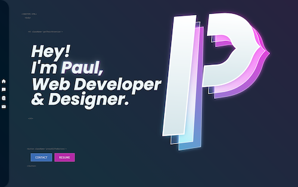
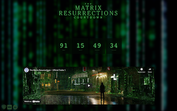
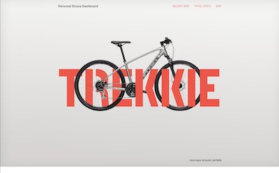
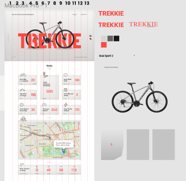
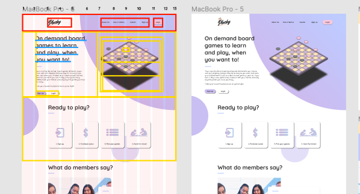

# Assessment 3 📝
Front End Developer Program - FED22

---

# S1
## Taking responsibility and being able to identify and plan out tasks needed to deliver user-interface based websites, services and applications.

# 🤔

---

> The ability to plan out tasks is something I have been working hard towards since this program began. 📤

 
---

Agile methodology is the main toolkit I have used to help plan out tasks I needed to complete, 
and to help prioritize. Kanban boards are the main method I use to track my projects during ideation to development. 

For example, during this individual project I completed 3 separate sites;

---

  
[Personal Portfolio Page](https://fleming.digital)

---

  
[Matrix Countdown Clock](https://matrix-countdown-clock.netlify.app)

ok I made that in an afternoon, so not so much kanban.

---

  
[Strava Dashboard](https://mytrekkie.netlify.app)

still have the kanban board up for this project, development is ongoing

---

I am not sure I would have been able to complete these projects if it wasn't for using Kanban boards to organize tasks. I also have come to learn to love moving the sticky notes to the next line, and taking a moment to celebrate moving a project forward.

---

While I have used online tools like Miro for Kanban boards, I have repurposed my office door to use as one as I have moved from project to project and I much prefer this method. 

---

I have also taken to adopting rapid iteration, utilizing continuous deployment from services like Netlify. Where I can deliver working software quickly and get changes out in smaller pieces rather than large changes.  
For example on my personal portfolio page, that was deployed with no animations working, and missing certain key aspects I wanted to include. However, because i deployed it early, I was able to send it out to potential employers and secure an internship before it was in its final state. 

---

Information about Agile can be found at the [Agile Manifesto](https://agilemanifesto.org/) site. 

---

Another toolkit I have utilized is my existing knowledge in the principals of design. This has allowed me to leverage those skills and translate them into effective UI design. I use Figma on almost every project, planning out the design and the elements I want to include.   
I also use figma to create component breakdowns. This is great as I can easily reference the Figma file to prevent me from having to think. Like which column the component needs to occupy, and how to structure components in JSX.

---

  
Here is a simpler version of the breakdown, where I have labeled the columns I intended to use on the page to help me quickly identify where things would be placed. 

---

  
Here is an example of the component breakdown the a design I created. Here I can quickly reference component structure and this project was one that really showed me the importance of planning the project early. Since I took the time to do this development was much quicker, and this assignment was one of 2 we had to complete in a week. So speed was critical.

---

[Github Deployment of the Plucky Page](https://github.com/wikidbrit/Plucky)
  
Here you can learn more about the Plucky project, and view the deployed page (desktop only) in the github pages environment. 

---
## Slides are written in Markdown!

Here's the source of the first slide:

    # Gatsby Deckf

    Create presentations using Gatsby & React.
