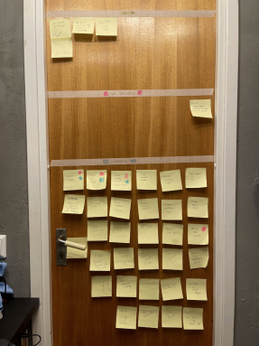

# Assessment 3
Front End Developer Program - 2022

---

# S1
## Taking responsibility and being able to identify and plan out tasks needed to deliver user-interface based websites, services and applications.

# 🤔

---

> The ability to plan out tasks is something I have been working hard towards since this program began.

---

Agile methodology is the main toolkit I have used to help plan out tasks I needed to complete, 
and to help prioritize. Kanban boards are the main method I use to track my projects during ideation to development. 

For example, during this individual project I completed 3 separate sites;

---

  
[Personal Portfolio Page](https://fleming.digital)

---

[Matrix Countdown Clock](https://matrix-countdown-clock.netlify.app)
###### desktop only*

---

[Strava Dashboard](https://mytrekkie.netlify.app)

---

I am not sure I would have been able to complete these projects if it wasn't for using Kanban boards to organize tasks. I also have come to learn to love moving the sticky notes to the next line, and taking a moment to celebrate moving a project forward.

---

While I have used online tools like Miro for Kanban boards, I have repurposed my office door to use as one as I have moved from project to project and I much prefer this method. 

---

I have also taken to adopting rapid iteration, utilizing continuous deployment from services like Netlify. Where I can deliver working software quickly and get changes out in smaller pieces rather than large changes.  
For example on my personal portfolio page, that was deployed with no animations working, and missing certain key aspects I wanted to include. However I was able to send it out and secure an internship before it was in its final state. 

---

Information about Agile can be found at the [Agile Manifesto](https://agilemanifesto.org/) site. 

---
## Slides are written in Markdown!

Here's the source of the first slide:

    # Gatsby Deck

    Create presentations using Gatsby & React.
