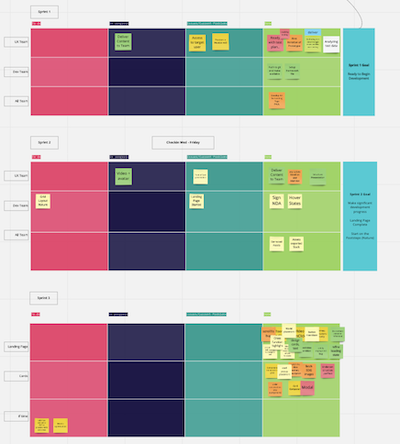
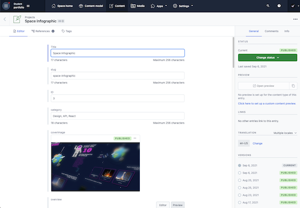

# C1 

## Independently use adequate technologies required in the professional role of front end developer to create frontend-solution

# 🤔
---

> Identifying when to use and not to use certain technologies is a critical step to meeting project goals and, if not more importantly, project deadlines.

---

To me this section speaks to both software to support development, and what to choose to include in your tech stack. 

---

I have spoken about utilizing Figma earlier in this presentation, but why do I use this design tool?

Figma is developed to support the design process in the context of UI design. It includes the tools needed not only to create the inital design concepts quickly and easily, but additionally the ability to create an entire design system to support designers and developers in the future 

---

   
I have been and continue to use Figma as my design tool of choice when developing UI designs. I also use tools like Illustrator and Photoshop to support the asset creation process, but Figma stands out as the one consistant across projects.

---

That is just 12 of the multitude of projects I have utilized Figma for.

---

Another tool worth mentioning would be Miro. During this school year Miro has been really important to being able to communicate ideas quickly and to collaborate during ideation sessions. I will show you some examples of how we moved through a specific project utilizing Miro as a collaboration tool.

---

   
Initial group meeting, doing a point of departure together. This is a great tool to get to know people who were essentially strangers. 

---

  
This is one of the first brainstorm sessions we participated in, coming up with ideas.

---

  
These are sprint logs, where we tracked weekly sprints in Kanban boards.

---

So this project is a great example of utilizing Miro to collaborate. Worth mentioning is Miro is not a communication tool like Zoom or Discord. Which I have also used extensively during this period. 

---

My primary development environment is VS Code. The reason I use this tool is because of its extensive extension support, and its wide use out in the professional world. 

---

  
This is a screenshot from my personal portfolio project, completed during this Independent Project

---

Outside of software, another answer to this point is the use of technologies to adopt during development. These can be npm packages to rapidly add features, templates that can setup a framework quickly, or go as far as an external CMS that can be queried to render content.

---

The background of this presentation is an npm package called react-particle-backgrounds

---

The presentation itself is a gatsby template called gatsby-starter-deck

---

These are examples of tools I have used to expedite development. Its important to evaluate packages for their integrity. For example its popularity, latest update, weekly downloads, etc. These can be good indicators to evaluate if you should use it or not. 

---

I also spoke about utilizing an external CMS. My portfolio page utilizes an external headless CMS to populate project content. This allows me to simply add the content outside of my code editor from anywhere and update my site.

---

  
I used contentful as its a popular choice, and I have had previous experience with that specific platform.

---

# 🏆🏆

This evidence shows I have an understanding of when and where to use different tools and technologies in the context of front end development. And my ability to judge and evaluate if I should use them to create a frontend solution.

---

> C1
> Reference / Links

- 563 Total Words
- <a href='https://github.com/wikidbrit/assessment_3/blob/main/src/slides/02-C1.md' target="_blank" >Slides Overview C1</a>

