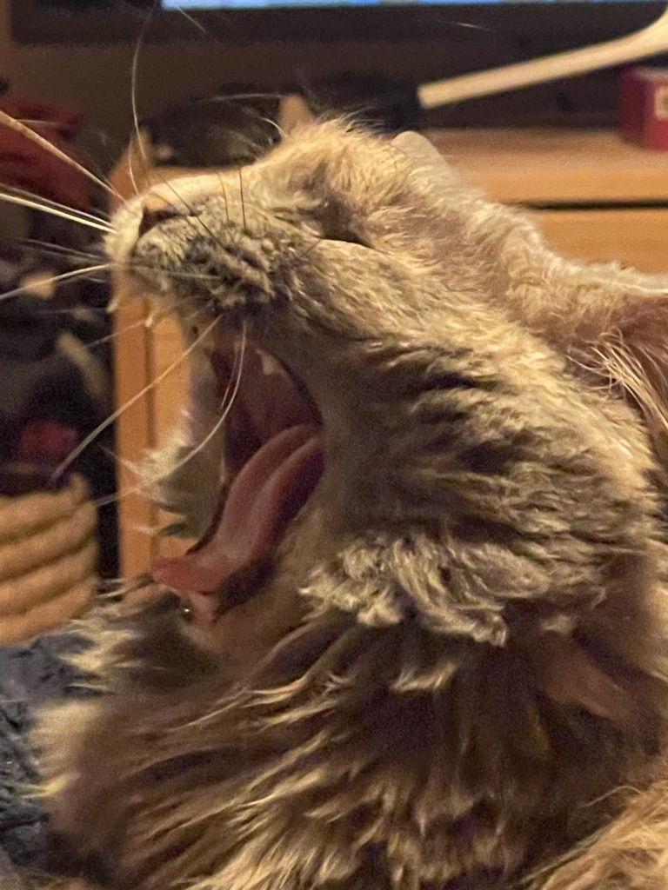

# C6

## Apply core and/or fundamental and/or specialized knowledge within Frontend development for its own continuing learning and continuous professional development

# 🤔

---

> To me this speaks to efforts I have taken to utilize tools that I wanted to learn, and projects I have undertaken to further my personal learning journey into the areas of industry I want to enter. 

---

Firstly I really believe in the Gatsby approach to development. Where you let developers develop, and you let marketing handle content. The old days of utilizing tools like wordpress, webflow, and others I think homogenizes the internet and asks people to do more than they should. 

---

A designer should design, a developer should develop, and marketing person should handle content.

This belief has encouraged me to learn Gatsby, Figma and content management systems.

---

This is why on my personal portfolio page I utilized those tools, and was the first thing I undertook during this Independent Project module. 

---

These decisions of course steer me away from some of the work that's out there. Wordpress accounts for a large portion of the web. But to be frank, I don't want to work in a place that churns out websites like a robot. I want to work creatively and to push boundaries to develop one of a kind solutions that stand out. To me that seems like a better place to work.

---

Thankfully that has paid off.

---
  
I have secured an internship at a company that uses Gatsby and Graphql as major parts of their tech stack. 

---

Outside of my personal beliefs, it's important to evaluate personal learning decisions based on industry trends. 

---

[State of JS](https://2020.stateofjs.com/en-US/technologies/front-end-frameworks/) is a great resource to evaluate trends in the industry. From the popularity of Frontend Frameworks (linked) to the resources developers are currently using. State of JS is a phenomenal source of information derived from working professionals that can be used to inform decisions.

---

What has ultimately worked for me is coding itself for continuous learning. Picking projects in an area I want to understand to a higher degree.

---

That is where the Strava Personal Dashboard came from. I wanted to learn how to use axios and how to better organize data from an api. 

---

It not only taught me what I wanted to learn, but also gave me a better understanding of useState and useEffect in react. 

---

I have also started refactoring the project as it's not following DRY principals, something I have not always had the time to do at school. That in itself has become a great opportunity to reinforce the earlier learnings.

---

These are things that are unintended but positive results of picking a project and getting going. And not getting stuck in tutorial hell.

---

# 🏆🏆🏆

This evidence shows I have applied my knowledge in the front end ecosystem to inform decisions related to my continual learning and professional growth. These decisions have gotten me an internship and I believe I am in a position to go into the real world and create unique solutions for employers and clients.

---

> C6
> Reference / Links

- 499 Total Words
- [🔗 Master File - Slides](https://github.com/wikidbrit/assessment_3/blob/main/src/slides/03-C6.md)

---

# Thank You For Reading

---

that was the end, why did you click?

---

seriously there is no more

---

go away now

---

FINE

---

Here is a picture of my cat yawning...

---

---

Hope you're happy

---

# 👋